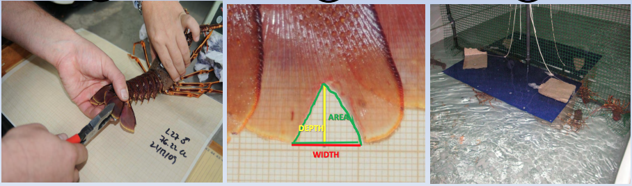

```{r setup, include=FALSE}
knitr::opts_chunk$set(echo = TRUE)
library(readxl)
library(ggplot2)
library(survival)
library(survminer)
```

**INSTRUCCIONES GENERALES**

1) Elabore un script R Markdown usando el programa Rstudio en su versión cloud y guárdelo en su directorio como: Prueba_3.Rmd

2) Resuelva los ejercicios propuestos en esta prueba en grupos de 2 o 3 alumnos.

3) Instale las siguientes librerías **readxl**, **ggplot2**, **survival**,*
**survminer**.

4) Compile el código con el botón Knit y guardelo en formato pdf.

5) Envíe su prueba al siguiente correo antes del jueves 20 de mayo a las 18:00 P <jose.gallardo@pucv.cl>

**DESARROLLO DE LA PRUEBA**

**Ejercicio 1.** Hune y Ojeda (2012) investigaron el ensamble de peces costeros de los canales y fiordos de la zona central de la Patagonia chilena y demostraron que la diversidad de especies es mayor en la zona Este (36 especies) que en la zona Oeste (9 especies) [Hune y Ojeda (2012)](http://dx.doi.org/10.4067/S0718-19572012000300008)

Como parte de una nueva campaña de muestreo usted debe analizar y comparar la diversidad de especies en los mismos sitios de muestreo según los datos de la siguiente tabla colectados el año 2020.

```{r, echo=FALSE}
Muestra <- c(1,2,3,4,5,6)
Este <- c(6, 13, 18, 24, 30, 37)
Oeste <- c(6, 6, 7, 8, 8, 10)


dat <- data.frame(Muestra, Este, Oeste)
  
knitr::kable(dat, col.names=c("Muestra", "Este", "Oeste"), caption = "Tabla 1. Riqueza acumulada de peces costeros en la Patagonia")

```

a) Escriba una hipótesis nula y alternativa para este experimento.

```{r, echo=FALSE}

# H0 : La riqueza de peces costeros es igual en la zona Este y Oeste de la patagonia.
# H1 : La riqueza de peces costeros es mayor en la zona Este de la patagonia.

```

b) Elabore una gráfica de líneas y puntos para comparar la riqueza acumulada de peces costeros similar a la que se muestra a continuación. Use como guía este [tutorial](http://www.sthda.com/english/wiki/ggplot2-line-plot-quick-start-guide-r-software-and-data-visualization)

```{r, echo=FALSE, fig.cap="Figura 1 - Riqueza de peces costeros en la zona Este y Oeste de la patagonia"}
dat2 <- data.frame(Sitio=rep(c("Este", "Oeste"), each=6), Muestra=rep(c("1", "2", "3", "4", "5", "6"),2), Riqueza=c(6, 13, 18, 24, 30, 37, 6, 6, 7, 8, 8, 10))

p<-ggplot(dat2, aes(x=Muestra, y=Riqueza, group=Sitio)) +
  geom_line(aes(color=Sitio))+
  geom_point(aes(color=Sitio))
p
```

c) Ponga a prueba su hipótesis usando el test de wilcoxon y la función **wilcox.test()**.

```{r, echo=FALSE, warning=FALSE}
# # Data.frame
# Muestra <- c(1,2,3,4,5,6)
# Este <- c(6, 13, 18, 24, 30, 37)
# Oeste <- c(6, 6, 7, 8, 8, 10)
# 
# # Prueba de Wilcoxon en R (wilcox.test)
# wilcox.test(Este, Oeste, alternative = "g", paired = FALSE)

```

d) Interprete sus resultados haciendo referencia a la hipótesis y el valor de significancia.

**Ejercicio 2.** La merluza austral es un recurso pesquero con distribución circumglobal del 'hemisferio sur' que se puede encontrar en aguas marinas de Uruguay, Argentina, Chile, Australia y Nueva Zelanda. 

En el siguiente estudio se desea evaluar si el tamaño de larvas de esta especie es diferente entre 5 zonas de fiordos del Sur de Chile. 

Para ello se cuenta con una base de datos (**cimar8.xlsx**) generada en el crucero ocenográfico CIMAR 8 Fiordos descrito por [Córdoba y Balbontin,  2006](http://www.cona.cl/cona_new/ctmol2/vol29-1/html/12_Cordova/cordova.pdf).

a) Escriba una hipótesis nula y alternativa para este estudio.

```{r, echo=FALSE}

# H0 : La concentración de fitoplancton no es diferente entre los años 2016, 2018, 2020.
# H1 :  La concentración de fitoplancton no es diferente entre los años 2016, 2018, 2020.

```

b) Elabore una gráfica de boxplot para comparar la longitud larval entre zonas similar a la que se muestra a continuación. Use como guía este [tutorial](http://www.sthda.com/english/wiki/ggplot2-box-plot-quick-start-guide-r-software-and-data-visualization)

```{r, echo=FALSE, fig.cap="Figura 2 - Comparación de longitud de larvas de Merluza austral entre zonas de la patagonia"}

Guafo <- rnorm(11, 9, 2)
Moraleda <- rnorm(20, 7.8, 2)
King <- rnorm(23, 8, 3)
Ninualac <- rnorm(10, 15, 2)
Darwin <- rnorm(7, 11, 3)
larvas <- data.frame(Zonas=rep(c("Guafo", "Moraleda", "King", "Ninualac","Darwin"), c(11,20,23,10,7)), Longitud=c(Guafo, Moraleda, King, Ninualac,Darwin))

# Exporta datos 
write.table(larvas, file="cimar8.xlsx", sep = ";", col.names = TRUE, dec=".")

q<-ggplot(larvas, aes(x=Zonas, y=Longitud, color=Zonas)) +
  geom_boxplot()
q
```


c) Realice un test de kruskal wallis para evaluar su hipótesis usando la función **kruskal.test()**. Note que debido a la disposición de los datos en **cimar8.xlsx** debe elaborar una función de Longitud ~ Zonas.

```{r, echo=FALSE}

# kruskal.test(Longitud ~ Zonas, data=larvas)

```

d) Interprete sus resultados haciendo referencia a la hipótesis y el valor de significancia.

**Ejercicio 3.** La langosta roja *Palinurus elephas* de las Islas Baleares de España es un recurso que ha estado sujeto a sobreexplotación pesquera. 

Para avanzar hacia una gestión sostenible, investigadores del Instituto Español de Oceanografía han propuesto que los pescadores puedan marcar a las langostas de talla inferior a la legal o en hembras ovadas antes de devolverlas al mar. 

```{r, echo=FALSE, fig.cap="Figura 3 - Langosta con marca V"}

```

Esto permitiría identificar de una manera fácil y rápida a los individuos ilegales que se quieran introducir en el mercado, pero surge la duda del efecto que esta marca pueda tener sobre la sobrevivencia de las Langostas.

A partir de los datos de sobrevivencia de Langostas marcadas y no marcadas (**langostas.xlsx**) determine si la marca genera un efecto perjudicial sobre las Langostas.

a) Escriba una hipótesis nula y alternativa para este experimento.

```{r, echo=FALSE}

# H0 : La sobrevivencia de Langostas marcadas y no marcadas es igual.
# H1 : La sobrevivencia de Langostas marcadas y no marcadas es diferente.

```

b) Importe la hoja 1 set de datos **langostas.xlsx** usando la función **read_excel()** de la librería *readxl*. No olvide usar el argumento *Sheet=1*. Explore el set de datos usando la función **summary()**. Luego transforme la variable *Marca* de caracter a factor con la función **as.factor()** y compruebe que se ha realizado el cambio con la función **str()**.

```{r, echo=FALSE}
langostas <- read_excel("langostas.xlsx", sheet = 1)
# summary(langostas)
langostas$Marca <- as.factor(langostas$Marca)
# str(langostas)
```

c) Calcule e imprima la probabilidad de sobrevivencia kaplan-meier del set de datos scallop. Siga el ejemplo visto en clases para construir el modelo y comparar entre grupos con y sin depredadores usando las funciones **survfit()** y **Surv()**.

```{r, echo=FALSE}
# p_langostas <- survfit(Surv(survival_time,survival_status)~strata(Marca),
#              data = langostas, na.action=na.exclude, type="kaplan-meier")
# 
# summary(p_langostas)

```

d) A partir de la probabilidad de sobrevivir calculada en el ejercicio anterior elabore una gráfica de sobrevivencia similar a la siguiente figura elaborada con la función **ggsurvplot()** de la librería **survminer**. Use el siguiente tutorial como guía [survival analysis](http://www.sthda.com/english/wiki/survival-analysis-basics) 

```{r, echo=FALSE, warning=FALSE, fig.cap="Figura 4 - Curvas de sobrevivencia entre langostas marcadas y no marcadas"}

fit <- survfit(Surv(survival_time, survival_status) ~ Marca, data = langostas)
ggsurvplot(fit,
          pval = TRUE, conf.int = FALSE,
          linetype = "strata", # Change line type by groups
          surv.median.line = "hv", # Specify median survival
          ggtheme = theme_bw(), # Change ggplot2 theme
          palette = c("#E7B800", "#2E9FDF"))
```

e) Realice una prueba no paramétrica de Log rank test para comparar estadísticamente las curvas de supervivencia usando la función **survdiff()**.

```{r, echo=FALSE}
# surv_diff <- survdiff(Surv(survival_time,survival_status)~Marca, data = langostas)
# surv_diff
```

f) Interprete sus resultados.

